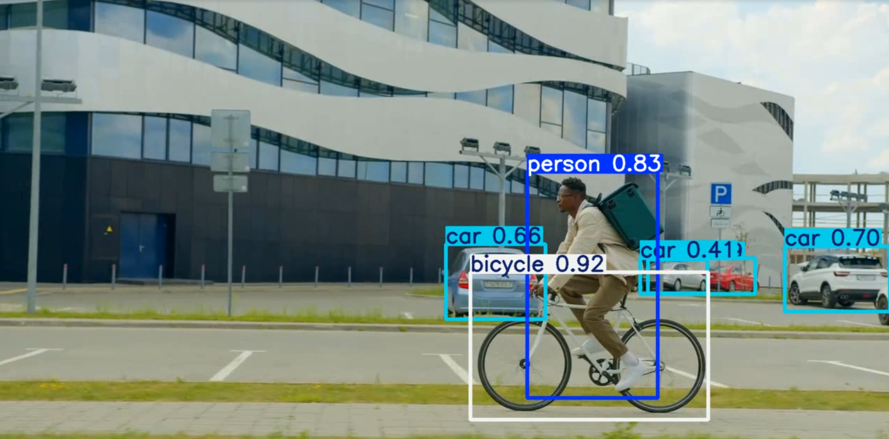

# YOLO Object Detection

This is my personal project to build an **end-to-end object detection pipeline** using [Ultralytics YOLOv8](https://github.com/ultralytics/ultralytics).  
It covers **data labelling, training, evaluation, and real-time video inference**.



---
## Project Structure
```
.
├── 01_labelling_images.ipynb       # image labelling with labelImg
├── 02_training_YOLO.ipynb          # training YOLO with custom dataset
├── configs/
│   └── data.yaml                   # dataset config (train/val paths, class names)
├── raw_images/                     
├── data/
│   ├── images/                     # raw images
│   ├── labels/                     # YOLO-format labels (.txt)
│   └── samples/                    # sample images/videos
├── results/                        # training runs, predictions, metrics
├── runs/                           # prediction result
└── README.md
```

---

## Setup
Install required library:
```bash
pip install -r requirements.txt
```